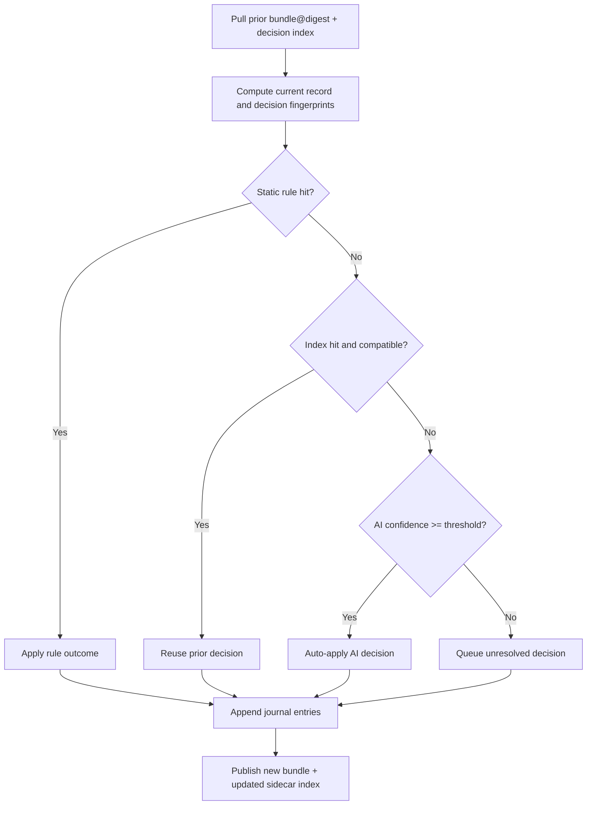

# 027 - Incremental Decision Memory and AI Reuse

Status: Complete
Owner: Platform (Underlay + consuming apps)
Created: 2026-03-02
Depends on: 025, 026

## Overview

This roadmap defines a canonical decision-memory system so migration decisions made in one pass can be reused in future passes. The objective is to avoid redoing human/AI decisions when refreshing bundles from evolving legacy systems.

## Decision

- [x] Store canonical decision memory in OCI artifacts with a sidecar index
- [x] Use deterministic fingerprints for decision lookup and reuse
- [x] Recompute only new/changed records and invalidated decisions
- [x] Preserve full audit trail for rule, AI, and human outcomes
- [x] Keep AI auto-apply with confidence threshold default `0.92`

## Problem Statement

Without reusable decision memory, repeated migration passes require costly manual queues and redundant AI calls. This creates churn, cost, and inconsistent outcomes between demo refresh cycles.

## Goals

1. Reuse prior decisions when decision context is unchanged
2. Invalidate decisions deterministically when compatibility inputs change
3. Track provenance and auditability for each decision outcome
4. Minimize AI calls by default during incremental refreshes

## Non-Goals

1. Blind reuse across schema or prompt incompatibilities
2. Storing opaque model outputs without structured decision records
3. Hiding human overrides in non-auditable channels

---

## Core Concept

Use OCI as canonical decision memory with a sidecar index artifact keyed by deterministic decision fingerprints.

Each new migration pass:

1. Pulls previous bundle digest and sidecar decision index
2. Computes current decision fingerprints
3. Reuses matching compatible decisions
4. Resolves only new/changed/unresolved fingerprints
5. Publishes updated journal and index artifacts

---

## Decision and Record Fingerprinting

### Decision Fingerprint

```text
fingerprint = hash(
  canonical_decision_input +
  decision_type +
  resolver_version +
  prompt_version +
  target_schema_version
)
```

### Record Fingerprint

```text
record_fingerprint = hash(
  canonical_transform_input +
  source_identity +
  semantic_dependencies
)
```

### Classification States

- `unchanged`: reuse prior transform outputs and decision outcomes
- `changed`: invalidate dependent decisions and recompute
- `new`: run full decision flow

---

## Data Contracts

### `decision_journal.ndjson` (bundle payload)

Each record includes:

1. `decision_id` (UUIDv7)
2. `fingerprint`
3. `decision_type`
4. `outcome`
5. `confidence`
6. `resolver_version`
7. `prompt_version`
8. `created_at`
9. `provenance` (`rule|ai|human`)

### `decision_index.json` (sidecar artifact)

```json
{
  "schema_version": "1",
  "bundle_digest": "sha256:...",
  "entries": {
    "<fingerprint>": {
      "bundle_digest": "sha256:...",
      "decision_id": "0195...",
      "created_at": "2026-03-02T12:00:00Z"
    }
  }
}
```

---

## Reuse and Invalidation Rules

### Reuse Algorithm

1. static rule hit -> apply
2. decision index hit with compatible fingerprint -> reuse
3. AI evaluation for misses
4. if confidence >= threshold -> auto-apply
5. otherwise -> unresolved queue
6. append new/updated decisions to current journal
7. publish updated sidecar index

### Invalidation Conditions

A prior decision is invalid if any differ:

1. `resolver_version`
2. `prompt_version`
3. `target_schema_version`
4. plugin invalidation hook indicates semantic dependency drift

### Reuse Policy Interface

- `strict`: exact version and fingerprint compatibility
- `compatible`: plugin-declared compatibility window with explicit safeguards

### `DecisionReusePolicy::Compatible` Windows (Concrete Examples)

Compatibility mode is opt-in and must be bounded by plugin policy. Example windows:

1. `resolver_version` compatibility:
   - accepted: same major (`3.x` -> `3.y`) when plugin declares backward-compatible decision semantics
   - rejected: major bump (`3.x` -> `4.x`)
2. `prompt_version` compatibility for AI decisions:
   - accepted: formatting-only or instruction-clarity revisions with stable extraction fields
   - rejected: intent/rubric changes that alter outcome semantics
3. `target_schema_version` compatibility:
   - accepted: additive schema changes that do not alter fields used by the decision fingerprint
   - rejected: renamed/removed fields referenced by `canonical_decision_input`

Required safety checks in compatible mode:
1. plugin must emit compatibility reason per reused decision
2. reuse must be blocked when compatibility reason is absent
3. compatibility-based reuse must be reported separately from strict fingerprint hits

### Sidecar Index Merge Conflict Rules

When multiple prior indexes are merged for a refresh pass, merge order and winner selection must be deterministic.

Merge input ordering:
1. sort by `bundle_created_at` ascending
2. tie-break by `bundle_digest` lexical ascending
3. apply latest compatible entry as candidate winner

Conflict classes:
1. `same_fingerprint_same_decision_id`:
   - action: keep one entry (dedupe), union provenance links
2. `same_fingerprint_different_decision_id`:
   - action: prefer entry with newest `created_at` if compatibility checks pass
   - if both are compatible and same timestamp, prefer lexical max `decision_id`
   - always emit conflict audit record
3. `same_fingerprint_incompatible_versions`:
   - action: reject both entries for reuse and force recompute
   - emit invalidation reason `index_merge_incompatible`
4. `fingerprint_without_journal_backing`:
   - action: treat as corrupted entry, fail integrity gate in strict mode

Sidecar merge output requirements:
1. merged `decision_index.json` with deterministic ordering of keys
2. merge report summarizing deduped, replaced, invalidated, and corrupted counts
3. integrity digest of merged index for promotion evidence

---

## Decision Reuse Lifecycle



---

## Glossary

- `decision_fingerprint`: deterministic key for a specific decision context.
- `record_fingerprint`: deterministic key for source transform input context.
- `decision_journal`: append-only decision log stored with each bundle.
- `decision_index`: lookup map from fingerprint to prior decision references.
- `reuse_policy`: compatibility mode for accepting prior decisions.

---

## Progress Checklist

- [x] Phase 27.1 complete (fingerprint and schema contracts)
- [x] Phase 27.2 complete (reuse engine and invalidation model)
- [x] Phase 27.3 complete (AI thresholding and unresolved queue contracts)
- [x] Phase 27.4 complete (audit trails, overrides, and governance)

---

## Phase 27.1 - Fingerprint and Schema Contracts

### 27.1.1 Add canonical input canonicalizer contract

- [x] Define `DecisionFingerprintInput` canonicalization rules
- [x] Define hashing algorithm and serialization format
- [x] Add compatibility/version metadata requirements

### 27.1.2 Add journal and index schema contracts

- [x] Define `DecisionJournalRecord` contract
- [x] Define `DecisionIndex` contract
- [x] Add schema-version migration strategy

### Acceptance Criteria (Phase 27.1)

- [x] Fingerprint generation is deterministic and test-covered
- [x] Journal/index schemas are documented and versioned
- [x] Contracts use `snake_case` naming

---

## Phase 27.2 - Reuse Engine and Invalidation Model

### 27.2.1 Implement lookup and reuse flow

- [x] Load sidecar index and resolve fingerprint hits
- [x] Reuse compatible prior decisions without re-calling AI
- [x] Append deltas for new/changed decisions only

### 27.2.2 Implement invalidation hooks

- [x] Version mismatch invalidation
- [x] Prompt drift invalidation
- [x] Plugin semantic dependency invalidation

### Acceptance Criteria (Phase 27.2)

- [x] Unchanged records produce zero new decisions
- [x] Changed records invalidate only dependent decisions
- [x] Invalidation reasons are logged and auditable
- [x] Sidecar merge conflicts are resolved deterministically with audit evidence

---

## Phase 27.3 - AI Thresholding and Unresolved Queue

### 27.3.1 Define threshold policy contract

- [x] Add global default threshold (`0.92`)
- [x] Add per-decision-type override support
- [x] Record threshold used per AI decision

### 27.3.2 Define unresolved queue contract

- [x] Emit unresolved records with deterministic identifiers
- [x] Include context for human follow-up decisions
- [x] Allow replay ingestion of human decisions

### Acceptance Criteria (Phase 27.3)

- [x] High-confidence AI decisions auto-apply consistently
- [x] Low-confidence decisions are queued and persisted
- [x] Subsequent pass can reuse human-resolved outcomes
- [x] Refresh-pass AI call suppression KPI is reported and trendable

### AI Call Suppression KPI Contract

Track suppression in every refresh run to verify reuse performance.

Required counters:
1. `candidate_decisions_total`
2. `reused_decisions_total`
3. `new_ai_calls_total`
4. `new_human_required_total`
5. `invalidated_decisions_total`

Derived metrics:
1. `ai_call_suppression_ratio = 1 - (new_ai_calls_total / candidate_decisions_total)`
2. `reuse_ratio = reused_decisions_total / candidate_decisions_total`
3. `human_queue_ratio = new_human_required_total / candidate_decisions_total`

Default targets for stable projects (after first accepted demo baseline):
1. `ai_call_suppression_ratio >= 0.85`
2. `reuse_ratio >= 0.80`
3. `human_queue_ratio <= 0.05`

Escalation policy:
1. if suppression drops below target for 2 consecutive refresh passes, require migration plugin review
2. if invalidation spikes above `0.20` of candidates, require dependency-drift audit before promotion
3. promotion release note must include KPI deltas vs previous accepted pass

---

## Phase 27.4 - Audit Trails, Overrides, and Governance

### 27.4.1 Add override and provenance semantics

- [x] Human override records supersede prior AI outcomes
- [x] Preserve full provenance chain per decision fingerprint
- [x] Keep append-only audit integrity

### 27.4.2 Add governance controls

- [x] Integrity checks for journal/index artifacts
- [x] Access and tamper visibility requirements for decision updates
- [x] Policy docs for retention and redaction boundaries

### Acceptance Criteria (Phase 27.4)

- [x] Human overrides persist across future passes
- [x] Audit trail supports reconstruction of decision lineage
- [x] Governance requirements documented and test-covered

### Retention and Redaction Policy

1. Decision journal retention:
   - Keep append-only `decision_journal` records for all promoted demo/pre-prod bundles.
   - Minimum retention: 180 days for non-production demos, 365 days for production-bound migration runs.
   - Never mutate historical entries in place; superseding is represented by new entries.
2. Unresolved queue retention:
   - Keep unresolved records until one of:
     - a human override decision is appended for the same fingerprint
     - the unresolved item exceeds retention policy and is archived with audit metadata
3. Redaction boundaries:
   - Allowed to redact only `canonical_decision_input` fields marked sensitive by plugin policy (for example PII text blobs).
   - Must never redact:
     - `fingerprint`
     - `decision_type`
     - `provenance`
     - `resolver_version`
     - `prompt_version`
     - `target_schema_version`
     - `created_at`
     - lineage identifiers (`decision_id` / `unresolved_id`)
4. Audit guarantees after redaction:
   - Redacted payloads must retain structural placeholders so deterministic lineage queries remain valid.
   - Any redaction must emit a governance note with timestamp and actor identity.
5. Integrity enforcement:
   - Governance validation must fail replay verification when journal or unresolved records violate contract requirements.
   - Operator reporting must include grouped issue summaries and sample issue details.

---

## Risks and Mitigations

- Risk: fingerprint inputs omit semantically important fields
  - Mitigation: plugin-declared semantic dependency contracts and conformance tests.
- Risk: compatibility mode reuses stale decisions
  - Mitigation: strict mode default for critical decision types and explicit invalidation logs.
- Risk: sidecar index drift from bundle history
  - Mitigation: digest linkage validation and index rebuild command support.

## Traceability Matrix (Phase -> File -> Evidence)

| Phase | Primary Implementation Files | Evidence Artifacts |
|---|---|---|
| 27.1 Fingerprint/schema contracts | `rust/crates/underlay-migration-core/src/plugin.rs`, `docs/guides/code/205-legacy-migration-framework/decision_journal.sample.ndjson`, `docs/guides/code/205-legacy-migration-framework/decision_index.sample.json` | deterministic fingerprint tests and schema validation checks |
| 27.2 Reuse/invalidation engine | `rust/crates/underlay-migration-core/src/pipeline.rs`, `rust/crates/underlay-devtools/src/migration_report.rs` | reuse ratio + invalidation reason summaries in run/report outputs |
| 27.3 AI threshold + unresolved queue | `docs/guides/205-legacy-migration-framework.md`, `docs/guides/code/205-legacy-migration-framework/migration-system-setup.md` | unresolved queue artifacts and threshold-at-decision evidence |
| 27.4 Overrides/governance | `docs/guides/code/205-legacy-migration-framework/governance-policy.sample.json`, `rust/crates/underlay-devtools/src/migration_report.rs` | provenance chain checks and policy report compliance output |

Operator and agent guide mapping:
1. [205 - Legacy Migration Framework](../guides/205-legacy-migration-framework.md)
2. [Migration System Setup Playbook](../guides/code/205-legacy-migration-framework/migration-system-setup.md)
3. [AI Migration Handoff Prompt Template](../guides/code/205-legacy-migration-framework/ai-migration-handoff.prompt.md)

## Validation

```bash
# Planned crate-level checks (when implemented)
cargo check -p underlay-migration-core --all-features
cargo test -p underlay-migration-core --all-features
cargo test -p underlay-devtools --all-features

# Broader verification at milestone boundaries
cargo test --all-features
bun check
```

## Completion Criteria

Roadmap 027 is complete when:

- [x] Deterministic decision and record fingerprint contracts are implemented
- [x] Incremental reuse works for unchanged records with no redundant AI calls
- [x] Invalidation is correct, targeted, and auditable
- [x] Human overrides and provenance are preserved across passes

## References

- [Package Map](../architecture/010-package-map.md)
- [Database & Migrations](../guides/050-database.md)
- [Media Library](../guides/077-media-library.md)
- [AI Runtime Routing](../guides/176-ai-runtime-routing.md)
